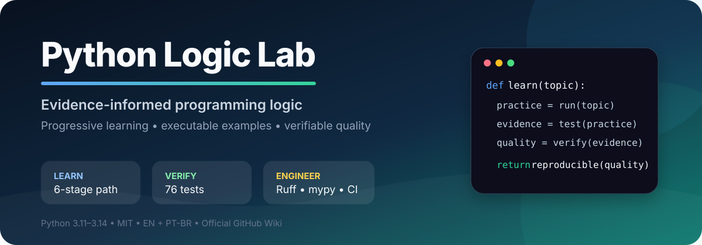

<div align="center">



<br>

[](https://github.com/matheusflorindo32/dio-estudos-logica-python/actions/workflows/python-tests.yml)
[](https://www.python.org/)
[](https://docs.astral.sh/ruff/)
[](https://mypy-lang.org/)
[](LICENSE)
[](https://github.com/matheusflorindo32/dio-estudos-logica-python/wiki)

**English** · [Português do Brasil](README.pt-BR.md)

[Explore the path](#learning-path) · [Run locally](#quick-start) · [Inspect quality](#quality-gates) · [Read the science](#scientific-foundation) · [Open the Wiki](https://github.com/matheusflorindo32/dio-estudos-logica-python/wiki)

</div>

> **DIO evaluators:** the complete Brazilian Portuguese version is available in [README.pt-BR.md](README.pt-BR.md).

---

## A compact laboratory, not a pile of snippets

**Python Logic Lab** is an open-source learning environment for introductory programming logic. It connects three layers that are often taught separately:

<table>
<tr>
<td width="33%" valign="top">

### Learn
Progressive exercises in variables, conditions, loops, functions, lists, and terminal applications.

</td>
<td width="33%" valign="top">

### Verify
Automated tests for normal behavior, boundaries, invalid input, errors, and command-line flows.

</td>
<td width="33%" valign="top">

### Engineer
Coverage, Ruff, mypy, multi-version CI, community files, documentation, and an official Wiki.

</td>
</tr>
</table>

The project is **evidence-informed**: its learning design is guided by published computing-education literature. It does not claim experimentally proven educational effectiveness. What it does prove is software behavior—through executable code, tests, coverage, static analysis, and continuous integration.

## At a glance

| Signal | Verified baseline |
|---|---:|
| Automated tests | **76 passing** |
| Combined line + branch coverage | **100%** |
| Enforced coverage floor | **90%** |
| Supported Python | **3.11 · 3.12 · 3.13 · 3.14** |
| Static checks | **Ruff · Ruff Formatter · mypy** |
| Documentation | **EN + PT-BR + official Wiki** |
| Runtime dependencies | **Python standard library only** |

> Metrics are intentionally shown as a verified baseline, not as a decorative static badge. The CI workflow is the source of truth.

## Learning path


| Stage | Focus | Practice | Progression |
|---:|---|---|---|
| 01 | Variables, types, operators | `desafios/01_variaveis.py` | Foundation |
| 02 | Conditions and boundaries | `desafios/02_condicionais.py` | Foundation |
| 03 | `for`, `while`, loop control | `desafios/03_repeticoes.py` | Developing |
| 04 | Functions, contracts, type hints | `desafios/04_funcoes.py` | Developing |
| 05 | Lists, search, ordering, removal | `desafios/05_listas.py` | Intermediate |
| 06 | Testable terminal applications | `exemplos/` + `tests/` | Applied |

Continue with the [five-week study plan](docs/plano-de-estudos.md) or the [official Wiki](https://github.com/matheusflorindo32/dio-estudos-logica-python/wiki).

## Quick start

**Requirements:** Python 3.11–3.14 and Git.

### Windows PowerShell

```powershell
git clone https://github.com/matheusflorindo32/dio-estudos-logica-python.git
Set-Location dio-estudos-logica-python
python -m venv .venv
.\.venv\Scripts\Activate.ps1
python -m pip install --upgrade pip
python -m pip install -r requirements-dev.txt
python -m pytest -v
```

### Linux and macOS

```bash
git clone https://github.com/matheusflorindo32/dio-estudos-logica-python.git
cd dio-estudos-logica-python
python3 -m venv .venv
source .venv/bin/activate
python3 -m pip install --upgrade pip
python3 -m pip install -r requirements-dev.txt
python3 -m pytest -v
```

## See the design in code

Run the interactive applications:

```bash
python exemplos/calculadora.py
python exemplos/organizador_estudos.py
python exemplos/verificador_aprovacao.py
```

Reuse the same rule without terminal I/O:

```python
from exemplos.calculadora import calcular

result = calcular(12, "/", 4)
print(result)  # 3.0
```

This separation makes the rules easier to test, reuse, and evolve into an API or graphical interface.

## Quality gates

```text
compileall  ── syntax and importability
pytest      ── behavior and error paths
pytest-cov  ── line and branch coverage
Ruff        ── lint, imports, safe modernization
Ruff format ── deterministic formatting
mypy        ── static type contracts
Actions     ── Python 3.11 through 3.14
```

Run the complete local pipeline:

```bash
python -m compileall .
python -m ruff check .
python -m ruff format --check .
python -m mypy exemplos desafios
python -m pytest --cov=exemplos --cov=desafios --cov-branch --cov-report=term-missing
```

| Gate | Current result | Policy |
|---|---:|---:|
| Tests | 76/76 | All must pass |
| Combined coverage | 100% | Minimum 90% |
| Ruff lint | 0 errors | 0 errors |
| Ruff formatting | Clean | No drift |
| mypy | Clean | No type errors |
| Compatibility | 3.11–3.14 | Every supported version |

Read the complete interpretation in [docs/quality.md](docs/quality.md).

## Why this repository stands out

| Dimension | Common introductory repository | Python Logic Lab |
|---|---|---|
| Learning material | Isolated snippets | Progressive executable modules |
| Behavior validation | Mostly manual | Unit, boundary, error, and CLI tests |
| Coverage | Often absent | Line and branch coverage |
| Architecture | Logic mixed with input/output | Importable business rules |
| Code quality | Style by convention | Ruff + formatter + mypy |
| Compatibility | One local version | CI on four Python versions |
| Research grounding | Usually undocumented | Published peer-reviewed sources |
| Documentation | README only | EN, PT-BR, docs, and official Wiki |

## Scientific foundation

The active bibliography contains **published literature and recognized books—no preprints**.

| Theme | Source |
|---|---|
| Learning programming | Robins, Rountree & Rountree (2003) — [DOI](https://doi.org/10.1076/csed.13.2.137.14200) |
| Novice difficulties | Lahtinen, Ala-Mutka & Järvinen (2005) — [DOI](https://doi.org/10.1145/1151954.1067453) |
| Cognitive load | Sweller (1988) — [DOI](https://doi.org/10.1207/s15516709cog1202_4) |
| Computing education | Duran, Zavgorodniaia & Sorva (2022) — [DOI](https://doi.org/10.1145/3483843) |
| Programming misconceptions | Herman et al. (2010) — [DOI](https://doi.org/10.1145/1734263.1734299) |

Complementary books include Eric Matthes's *Python Crash Course*, 3rd ed., and Luciano Ramalho's *Fluent Python*, 2nd ed. Language behavior is grounded in the [official Python 3.14 documentation](https://docs.python.org/3.14/).

Full bibliography: [docs/scientific-foundation.md](docs/scientific-foundation.md).

## Repository map

```text
.
├── .github/              # CI workflow and contribution templates
├── desafios/             # Progressive fundamentals
├── exemplos/             # Testable terminal applications
├── tests/                # Unit, boundary, error, and CLI tests
├── wiki/                 # Versioned sources for the official Wiki
├── docs/                 # Study, quality, science, i18n, evidence
│   └── assets/           # Lightweight visual identity
├── README.md             # International English landing page
├── README.pt-BR.md       # Brazilian Portuguese version
├── pyproject.toml        # Project and tool configuration
├── requirements-dev.txt  # Development dependencies
└── LICENSE               # MIT License
```

## Documentation

| Resource | Purpose | Language |
|---|---|---|
| [Official Wiki](https://github.com/matheusflorindo32/dio-estudos-logica-python/wiki) | Structured learning pages, examples, exercises, references | PT-BR |
| [Study plan](docs/plano-de-estudos.md) | Five-week guided progression | PT-BR |
| [Quality guide](docs/quality.md) | Tooling, coverage, CI, interpretation | EN |
| [Scientific foundation](docs/scientific-foundation.md) | Published bibliography and DOI links | EN |
| [Internationalization](docs/internationalization.md) | EN ↔ PT-BR synchronization policy | EN |
| [GitHub evidence](docs/recursos-github-utilizados.md) | Features used and delivery records | PT-BR |

## Contributing

Read [CONTRIBUTING.md](CONTRIBUTING.md), the [didactic contribution guide](docs/guia-de-contribuicao.md), and the [Code of Conduct](CODE_OF_CONDUCT.md).

A contribution should preserve five principles:

1. one clear learning objective;
2. small and readable examples;
3. tests for behavior and boundaries;
4. compatibility with supported Python versions;
5. synchronized English and Portuguese documentation.

## Roadmap

- expand the learning path without losing focus;
- preserve verifiable quality and multi-version compatibility;
- improve accessibility and navigation through learner feedback;
- add lightweight demonstrations only when they improve understanding;
- evolve the project through Issues, Pull Requests, and the public roadmap.

## License

Distributed under the [MIT License](LICENSE).

## Author

**Matheus Florindo de Deus**

Systems Analysis and Development student at IFES · multidisciplinary educator and researcher · research collaborator in Translational Physiology at UFES

[GitHub](https://github.com/matheusflorindo32) · [ORCID 0009-0006-3848-0662](https://orcid.org/0009-0006-3848-0662)

---

<div align="center">

### Built to be learned, run, tested, and verified.

**Don't negotiate with your mind.**

</div>
