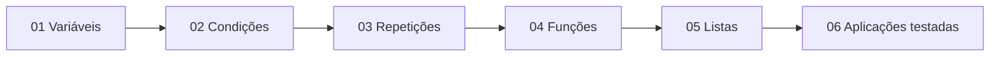

<div align="center">


<br>

[](https://github.com/matheusflorindo32/dio-estudos-logica-python/actions/workflows/python-tests.yml)
[](https://www.python.org/)
[](https://docs.astral.sh/ruff/)
[](https://mypy-lang.org/)
[](LICENSE)
[](https://github.com/matheusflorindo32/dio-estudos-logica-python/wiki)

[English](README.md) · **Português do Brasil**

[Conheça a trilha](#trilha-de-aprendizagem) · [Execute localmente](#início-rápido) · [Verifique a qualidade](#controles-de-qualidade) · [Consulte a ciência](#fundamentação-científica) · [Abra a Wiki](https://github.com/matheusflorindo32/dio-estudos-logica-python/wiki)

</div>

---

## Um laboratório compacto — não uma coleção de códigos soltos

O **Laboratório de Lógica com Python** é um ambiente educacional open source para os fundamentos da lógica de programação. Ele conecta três dimensões que frequentemente são ensinadas separadamente:

<table>
<tr>
<td width="33%" valign="top">

### Aprender
Exercícios progressivos sobre variáveis, condições, repetições, funções, listas e aplicações de terminal.

</td>
<td width="33%" valign="top">

### Verificar
Testes automatizados para comportamento normal, limites, entradas inválidas, erros e fluxos de linha de comando.

</td>
<td width="33%" valign="top">

### Construir com qualidade
Cobertura, Ruff, mypy, CI multiversão, arquivos comunitários, documentação e Wiki oficial.

</td>
</tr>
</table>

O projeto é **orientado por evidências**: seu desenho de aprendizagem é guiado por literatura publicada em educação em computação. Isso não equivale a afirmar eficácia educacional experimentalmente comprovada. O que o repositório comprova é o comportamento do software — por meio de código executável, testes, cobertura, análise estática e integração contínua.

## Visão rápida

| Indicador | Linha de base verificada |
|---|---:|
| Testes automatizados | **76 aprovados** |
| Cobertura combinada de linhas + branches | **100%** |
| Cobertura mínima exigida | **90%** |
| Python suportado | **3.11 · 3.12 · 3.13 · 3.14** |
| Análises estáticas | **Ruff · Ruff Formatter · mypy** |
| Documentação | **EN + PT-BR + Wiki oficial** |
| Dependências em execução | **Somente biblioteca padrão** |

> As métricas são apresentadas como uma linha de base verificada, e não como badge estático decorativo. A fonte de verdade é o workflow executável de CI.

## Trilha de aprendizagem



| Etapa | Foco | Prática | Progressão |
|---:|---|---|---|
| 01 | Variáveis, tipos e operadores | `desafios/01_variaveis.py` | Fundamentos |
| 02 | Condições e valores de fronteira | `desafios/02_condicionais.py` | Fundamentos |
| 03 | `for`, `while` e controle de repetição | `desafios/03_repeticoes.py` | Em desenvolvimento |
| 04 | Funções, contratos e type hints | `desafios/04_funcoes.py` | Em desenvolvimento |
| 05 | Listas, busca, ordenação e remoção | `desafios/05_listas.py` | Intermediário |
| 06 | Aplicações de terminal testáveis | `exemplos/` + `tests/` | Aplicado |

Continue pelo [plano de estudos de cinco semanas](docs/plano-de-estudos.md) ou pela [Wiki oficial](https://github.com/matheusflorindo32/dio-estudos-logica-python/wiki).

## Início rápido

**Requisitos:** Python 3.11–3.14 e Git.

### Windows PowerShell

```powershell
git clone https://github.com/matheusflorindo32/dio-estudos-logica-python.git
Set-Location dio-estudos-logica-python
python -m venv .venv
.\.venv\Scripts\Activate.ps1
python -m pip install --upgrade pip
python -m pip install -r requirements-dev.txt
python -m pytest -v
```

### Linux e macOS

```bash
git clone https://github.com/matheusflorindo32/dio-estudos-logica-python.git
cd dio-estudos-logica-python
python3 -m venv .venv
source .venv/bin/activate
python3 -m pip install --upgrade pip
python3 -m pip install -r requirements-dev.txt
python3 -m pytest -v
```

## Veja o desenho no código

Execute as aplicações interativas:

```bash
python exemplos/calculadora.py
python exemplos/organizador_estudos.py
python exemplos/verificador_aprovacao.py
```

Reutilize a mesma regra sem entrada e saída de terminal:

```python
from exemplos.calculadora import calcular

resultado = calcular(12, "/", 4)
print(resultado)  # 3.0
```

Essa separação facilita testes, reutilização e futura evolução para API ou interface gráfica.

## Controles de qualidade

```text
compileall  ── sintaxe e importação
pytest      ── comportamento e caminhos de erro
pytest-cov  ── cobertura de linhas e branches
Ruff        ── lint, imports e modernização segura
Ruff format ── formatação determinística
mypy        ── contratos estáticos de tipos
Actions     ── Python 3.11 a 3.14
```

Execute localmente toda a esteira:

```bash
python -m compileall .
python -m ruff check .
python -m ruff format --check .
python -m mypy exemplos desafios
python -m pytest --cov=exemplos --cov=desafios --cov-branch --cov-report=term-missing
```

| Controle | Resultado atual | Política |
|---|---:|---:|
| Testes | 76/76 | Todos devem passar |
| Cobertura combinada | 100% | Mínimo de 90% |
| Lint com Ruff | 0 erros | 0 erros |
| Formatação Ruff | Aprovada | Sem divergência |
| mypy | Aprovado | Sem erros de tipos |
| Compatibilidade | 3.11–3.14 | Todas as versões suportadas |

Consulte a interpretação completa em [docs/quality.md](docs/quality.md).

## Por que este repositório se destaca

| Dimensão | Repositório introdutório comum | Laboratório de Lógica com Python |
|---|---|---|
| Material de aprendizagem | Trechos isolados | Módulos executáveis e progressivos |
| Validação de comportamento | Principalmente manual | Testes unitários, limites, erros e CLI |
| Cobertura | Frequentemente ausente | Linhas e branches |
| Arquitetura | Lógica misturada à entrada/saída | Regras de negócio importáveis |
| Qualidade de código | Convenção informal | Ruff + formatter + mypy |
| Compatibilidade | Uma versão local | CI em quatro versões do Python |
| Fundamentação | Geralmente não documentada | Fontes publicadas e revisadas por pares |
| Documentação | Apenas README | EN, PT-BR, docs e Wiki oficial |

## Fundamentação científica

A bibliografia ativa reúne **literatura publicada e livros reconhecidos — sem preprints**.

| Tema | Fonte |
|---|---|
| Aprendizagem de programação | Robins, Rountree e Rountree (2003) — [DOI](https://doi.org/10.1076/csed.13.2.137.14200) |
| Dificuldades de iniciantes | Lahtinen, Ala-Mutka e Järvinen (2005) — [DOI](https://doi.org/10.1145/1151954.1067453) |
| Carga cognitiva | Sweller (1988) — [DOI](https://doi.org/10.1207/s15516709cog1202_4) |
| Educação em computação | Duran, Zavgorodniaia e Sorva (2022) — [DOI](https://doi.org/10.1145/3483843) |
| Concepções equivocadas | Herman et al. (2010) — [DOI](https://doi.org/10.1145/1734263.1734299) |

Livros complementares incluem *Python Crash Course*, de Eric Matthes, 3. ed., e *Fluent Python*, de Luciano Ramalho, 2. ed. O comportamento da linguagem é fundamentado na [documentação oficial do Python 3.14](https://docs.python.org/3.14/).

Bibliografia completa: [docs/scientific-foundation.md](docs/scientific-foundation.md).

## Mapa do repositório

```text
.
├── .github/              # Workflow de CI e templates de contribuição
├── desafios/             # Fundamentos progressivos
├── exemplos/             # Aplicações de terminal testáveis
├── tests/                # Testes unitários, limites, erros e CLI
├── wiki/                 # Fontes versionadas da Wiki oficial
├── docs/                 # Estudo, qualidade, ciência, i18n e evidências
│   └── assets/           # Identidade visual leve
├── README.md             # Página internacional em inglês
├── README.pt-BR.md       # Versão em português brasileiro
├── pyproject.toml        # Configuração do projeto e ferramentas
├── requirements-dev.txt  # Dependências de desenvolvimento
└── LICENSE               # Licença MIT
```

## Documentação

| Recurso | Finalidade | Idioma |
|---|---|---|
| [Wiki oficial](https://github.com/matheusflorindo32/dio-estudos-logica-python/wiki) | Páginas de aprendizagem, exemplos, exercícios e referências | PT-BR |
| [Plano de estudos](docs/plano-de-estudos.md) | Progressão guiada de cinco semanas | PT-BR |
| [Guia de qualidade](docs/quality.md) | Ferramentas, cobertura, CI e interpretação | EN |
| [Fundamentação científica](docs/scientific-foundation.md) | Bibliografia publicada e links DOI | EN |
| [Internacionalização](docs/internationalization.md) | Política de sincronização EN ↔ PT-BR | EN |
| [Evidências do GitHub](docs/recursos-github-utilizados.md) | Recursos utilizados e registros de entrega | PT-BR |

## Como contribuir

Leia [CONTRIBUTING.md](CONTRIBUTING.md), o [guia didático de contribuição](docs/guia-de-contribuicao.md) e o [Código de Conduta](CODE_OF_CONDUCT.md).

Uma contribuição deve preservar cinco princípios:

1. um objetivo de aprendizagem claro;
2. exemplos pequenos e legíveis;
3. testes de comportamento e fronteiras;
4. compatibilidade com as versões suportadas do Python;
5. documentação sincronizada em inglês e português.

## Roadmap

- ampliar a trilha sem perder o foco;
- preservar qualidade verificável e compatibilidade multiversão;
- melhorar acessibilidade e navegação com base no retorno dos estudantes;
- adicionar demonstrações leves apenas quando aumentarem a compreensão;
- evoluir o projeto por meio de Issues, Pull Requests e roadmap público.

## Licença

Distribuído sob a [Licença MIT](LICENSE).

## Autor

**Matheus Florindo de Deus**

Estudante de Análise e Desenvolvimento de Sistemas no IFES · educador e pesquisador multidisciplinar · colaborador de pesquisa em Fisiologia Translacional na UFES

[GitHub](https://github.com/matheusflorindo32) · [ORCID 0009-0006-3848-0662](https://orcid.org/0009-0006-3848-0662)

---

<div align="center">

### Construído para aprender, executar, testar e verificar.

**Não negocie com sua mente.**

</div>
