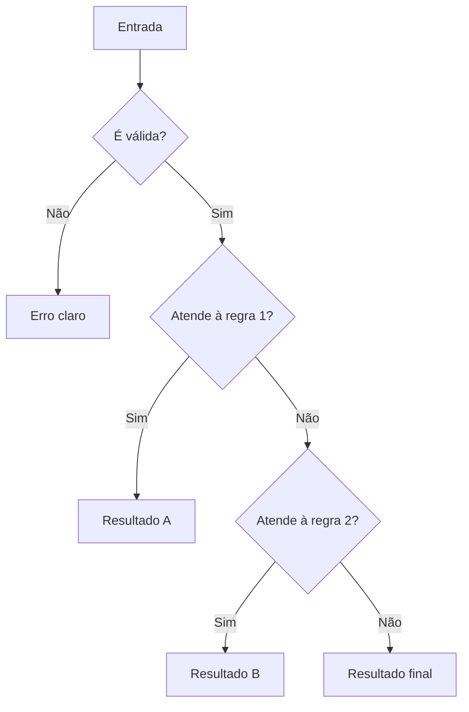

<div align="center">


[← Fundamentos](Introducao-a-Logica-de-Programacao-com-Python) · [Home](Home) · [Repetições →](Estruturas-de-Repeticao)

</div>

---

## O que você vai dominar

| Competência | Evidência prática |
|---|---|
| Ler decisões | prevê qual bloco será executado |
| Ordenar regras | começa pelo caso mais específico |
| Validar domínio | rejeita entradas semanticamente inválidas |
| Testar fronteiras | verifica antes, no limite e depois |
| Reduzir ambiguidade | separa validação de classificação |

> [!TIP]
> Condicionais não são apenas sintaxe: são uma forma de representar decisões com limites explícitos.

## 1. O fluxo de decisão



```python
idade = 20

if idade >= 18:
    print("Maior de idade")
else:
    print("Menor de idade")
```

## 2. Sintaxe com intenção

```python
if condicao_mais_especifica:
    caminho_1
elif condicao_alternativa:
    caminho_2
else:
    caminho_final
```

| Elemento | Papel |
|---|---|
| `if` | primeira decisão |
| `elif` | alternativa avaliada se as anteriores falharem |
| `else` | caminho residual |
| `:` | encerra o cabeçalho |
| indentação | define o bloco pertencente à condição |

> [!IMPORTANT]
> Em uma cadeia `if/elif/else`, somente o primeiro bloco verdadeiro é executado.

## 3. Exemplo central: classificação de nota

```python
def classificar_nota(nota: float) -> str:
    """Classifica uma nota válida entre 0 e 10."""
    if not 0 <= nota <= 10:
        raise ValueError("A nota deve estar entre 0 e 10.")

    if nota >= 7:
        return "Aprovado"
    elif nota >= 5:
        return "Recuperação"
    else:
        return "Reprovado"
```

### Leitura por camadas

| Camada | Pergunta |
|---|---|
| Validação | o valor pertence ao domínio `0..10`? |
| Faixa superior | é maior ou igual a `7`? |
| Faixa intermediária | é maior ou igual a `5`? |
| Faixa residual | sobrou algum valor válido abaixo de `5`? |

## 4. Por que a ordem importa

### Ordem incorreta

```python
if nota >= 5:
    resultado = "Recuperação"
elif nota >= 7:
    resultado = "Aprovado"
```

Para `nota = 8`, a primeira condição já é verdadeira. O segundo bloco nunca será alcançado.

### Ordem correta

```python
if nota >= 7:
    resultado = "Aprovado"
elif nota >= 5:
    resultado = "Recuperação"
else:
    resultado = "Reprovado"
```

> [!WARNING]
> Uma condição ampla colocada antes de uma condição específica pode tornar parte do código inalcançável.

## 5. Validação × classificação

```python
if not 0 <= nota <= 10:
    raise ValueError("Nota inválida")
```

| Situação | Sem validação | Com validação |
|---|---|---|
| `nota = -3` | “Reprovado” | erro de domínio |
| `nota = 12` | “Aprovado” | erro de domínio |

Separar essas responsabilidades melhora clareza, testes e manutenção.

## 6. Operadores lógicos

<table>
<tr>
<td width="33%" valign="top">

### `and`
Todas as condições precisam ser verdadeiras.

```python
if idade >= 18 and habilitado:
    autorizar()
```

</td>
<td width="33%" valign="top">

### `or`
Pelo menos uma condição precisa ser verdadeira.

```python
if sabado or domingo:
    descansar()
```

</td>
<td width="33%" valign="top">

### `not`
Inverte o valor lógico.

```python
if not ativo:
    bloquear()
```

</td>
</tr>
</table>

## 7. Fronteiras: onde os erros aparecem

| Nota | Esperado | Tipo de caso |
|---:|---|---|
| `0` | Reprovado | limite inferior válido |
| `4.9` | Reprovado | imediatamente antes da transição |
| `5` | Recuperação | transição |
| `6.9` | Recuperação | imediatamente antes da transição |
| `7` | Aprovado | transição |
| `10` | Aprovado | limite superior válido |
| `-0.1` | erro | abaixo do domínio |
| `10.1` | erro | acima do domínio |

> [!TIP]
> Para cada limite, teste três pontos: **antes, exatamente no limite e depois**.

## 8. Padrões melhores

### Evite comparação booleana redundante

```python
# Menos claro
if ativo == True:
    liberar()

# Preferível
if ativo:
    liberar()
```

### Use retorno antecipado para reduzir aninhamento

```python
def autorizar(idade: int) -> str:
    if idade < 0:
        raise ValueError("Idade inválida")
    if idade < 18:
        return "Não autorizado"
    return "Autorizado"
```

## 9. Erros comuns

> [!WARNING]
> - usar `=` quando a intenção é comparar com `==`;
> - colocar a condição mais ampla primeiro;
> - esconder entrada inválida dentro de uma classificação;
> - aninhar blocos sem necessidade;
> - testar apenas valores centrais;
> - misturar regra de negócio com `input()` e `print()`.

## 10. Atividade guiada

Implemente uma função para classificar temperatura:

- abaixo de `18`: `Frio`;
- de `18` até `27`: `Agradável`;
- acima de `27`: `Quente`.

Teste `17.9`, `18`, `27` e `27.1`.

## 11. Desafio independente

Classifique uma hora inteira entre `0` e `23` como madrugada, manhã, tarde ou noite. Defina os limites antes de codificar e escreva testes para cada transição.

## 12. Prática no projeto

```bash
python desafios/02_condicionais.py
```

Depois localize os testes e identifique:

- casos de sucesso;
- valores de fronteira;
- entradas inválidas;
- mensagens de erro esperadas.

## Referências

LAHTINEN, Essi; ALA-MUTKA, Kirsti; JÄRVINEN, Hannu-Matti. A study of the difficulties of novice programmers. *ACM SIGCSE Bulletin*, v. 37, n. 3, p. 14-18, 2005. DOI: <https://doi.org/10.1145/1151954.1067453>.

MCCALL, Davin; KÖLLING, Michael. A new look at novice programmer errors. *ACM Transactions on Computing Education*, v. 19, n. 4, p. 1-30, 2019. DOI: <https://doi.org/10.1145/3335814>.

ROBINS, Anthony; ROUNTREE, Janet; ROUNTREE, Nathan. Learning and teaching programming: a review and discussion. *Computer Science Education*, v. 13, n. 2, p. 137-172, 2003. DOI: <https://doi.org/10.1076/csed.13.2.137.14200>.

PYTHON SOFTWARE FOUNDATION. *The Python language reference: compound statements*. Versão 3.14. Disponível em: <https://docs.python.org/3.14/reference/compound_stmts.html>. Acesso em: 2 ago. 2026.

---

<div align="center">

[← Fundamentos](Introducao-a-Logica-de-Programacao-com-Python) · [Home](Home) · **Próxima etapa:** [Repetições →](Estruturas-de-Repeticao)

</div>
