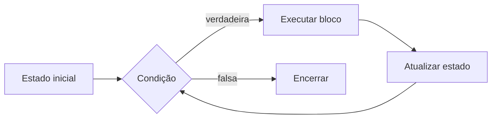

<div align="center">


[← Condicionais](Estruturas-Condicionais) · [Home](Home) · [Funções →](Funcoes-em-Python)

</div>

---

## O que você vai dominar

| Competência | Evidência prática |
|---|---|
| Escolher o laço | diferencia `for` e `while` |
| Rastrear estado | acompanha variáveis por iteração |
| Definir parada | explica quando e por que o laço termina |
| Controlar fluxo | usa `break` e `continue` conscientemente |
| Evitar falhas | identifica risco de laço infinito |

> [!TIP]
> Um laço é mais fácil de entender quando você separa **estado inicial, condição, corpo e atualização**.

## 1. O ciclo de repetição



## 2. `for`: percorrer algo conhecido

```python
for numero in range(1, 6):
    print(numero)
```

| Expressão | Produz |
|---|---|
| `range(1, 6)` | `1, 2, 3, 4, 5` |
| `range(5)` | `0, 1, 2, 3, 4` |
| `range(2, 10, 2)` | `2, 4, 6, 8` |

> [!NOTE]
> O limite final de `range()` não é incluído.

### Percorrendo uma lista

```python
nomes = ["Ana", "Bruno", "Carla"]

for nome in nomes:
    print(f"Olá, {nome}!")
```

## 3. `while`: repetir enquanto uma condição permanecer verdadeira

```python
contador = 5

while contador >= 0:
    print(contador)
    contador -= 1
```

<table>
<tr>
<td width="33%" valign="top">

### Estado inicial
`contador = 5`

</td>
<td width="33%" valign="top">

### Condição
`contador >= 0`

</td>
<td width="33%" valign="top">

### Atualização
`contador -= 1`

</td>
</tr>
</table>

> [!IMPORTANT]
> Se a atualização não aproximar o estado da condição de parada, o laço pode não terminar.

## 4. Rastreamento visual

```python
soma = 0

for numero in range(1, 4):
    soma += numero
```

| Iteração | `numero` | `soma` antes | Operação | `soma` depois |
|---:|---:|---:|---|---:|
| 1 | 1 | 0 | `0 + 1` | 1 |
| 2 | 2 | 1 | `1 + 2` | 3 |
| 3 | 3 | 3 | `3 + 3` | 6 |

> [!TIP]
> Use uma tabela de rastreamento sempre que perder o controle sobre a mudança das variáveis.

## 5. `break` e `continue`

<table>
<tr>
<td width="50%" valign="top">

### `break`
Interrompe o laço imediatamente.

```python
for numero in range(1, 11):
    if numero == 5:
        break
    print(numero)
```

</td>
<td width="50%" valign="top">

### `continue`
Pula o restante da iteração atual.

```python
for numero in range(1, 6):
    if numero == 3:
        continue
    print(numero)
```

</td>
</tr>
</table>

## 6. O padrão do laço infinito

```python
contador = 1
while contador <= 5:
    print(contador)
```

O problema é que `contador` nunca muda.

### Correção

```python
contador = 1
while contador <= 5:
    print(contador)
    contador += 1
```

> [!WARNING]
> Ao trabalhar com entrada externa, defina limite de tentativas, opção de cancelamento e condição explícita de encerramento.

## 7. Exemplo aplicado

```python
def verificar_senha(senha_correta: str, tentativas: list[str]) -> bool:
    """Retorna True se a senha correta surgir em até três tentativas."""
    for tentativa in tentativas[:3]:
        if tentativa == senha_correta:
            return True
    return False
```

### Por que esse desenho é testável?

- recebe os dados por parâmetro;
- limita as tentativas;
- não depende de `input()`;
- devolve um valor previsível;
- permite testar sucesso e falha.

## 8. Erros comuns

> [!WARNING]
> - esquecer de atualizar o estado do `while`;
> - errar o limite de `range()`;
> - alterar a coleção enquanto ela é percorrida;
> - usar `while True` sem saída segura;
> - confundir `break` com `continue`;
> - criar laços aninhados sem necessidade.

## 9. Atividade guiada

Crie uma função que receba uma lista de notas e calcule a média apenas das notas válidas entre `0` e `10`.

Requisitos:

- use `for`;
- ignore valores inválidos com `continue`;
- retorne `None` quando não houver notas válidas;
- escreva pelo menos três testes.

## 10. Desafio independente

Implemente uma função que receba temperaturas e conte a maior sequência consecutiva acima de um limite informado.

Teste:

- lista vazia;
- nenhum valor acima do limite;
- todos os valores acima;
- sequência interrompida no meio.

## 11. Prática no projeto

```bash
python desafios/03_repeticoes.py
```

Depois:

1. altere o número da tabuada;
2. rastreie as variáveis;
3. teste os limites de `range()`;
4. imponha no máximo três tentativas;
5. localize os testes correspondentes.

## Referências

LAHTINEN, Essi; ALA-MUTKA, Kirsti; JÄRVINEN, Hannu-Matti. A study of the difficulties of novice programmers. *ACM SIGCSE Bulletin*, v. 37, n. 3, p. 14-18, 2005. DOI: <https://doi.org/10.1145/1151954.1067453>.

ROBINS, Anthony; ROUNTREE, Janet; ROUNTREE, Nathan. Learning and teaching programming: a review and discussion. *Computer Science Education*, v. 13, n. 2, p. 137-172, 2003. DOI: <https://doi.org/10.1076/csed.13.2.137.14200>.

SWELLER, John. Cognitive load during problem solving: effects on learning. *Cognitive Science*, v. 12, n. 2, p. 257-285, 1988. DOI: <https://doi.org/10.1207/s15516709cog1202_4>.

PYTHON SOFTWARE FOUNDATION. *The Python language reference: compound statements*. Versão 3.14. Disponível em: <https://docs.python.org/3.14/reference/compound_stmts.html>. Acesso em: 2 ago. 2026.

---

<div align="center">

[← Condicionais](Estruturas-Condicionais) · [Home](Home) · **Próxima etapa:** [Funções →](Funcoes-em-Python)

</div>
