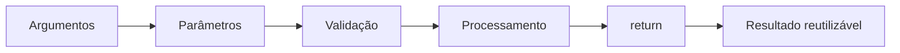

<div align="center">


[← Repetições](Estruturas-de-Repeticao) · [Home](Home)

</div>

---

## O que você vai dominar

| Competência | Evidência prática |
|---|---|
| Criar contratos | define parâmetros, retorno e erros |
| Reutilizar lógica | chama a mesma regra em contextos diferentes |
| Separar responsabilidades | distingue regra de negócio de terminal |
| Tornar código testável | usa entradas e retornos previsíveis |
| Comunicar intenção | aplica nomes, type hints e docstrings |

> [!TIP]
> Uma boa função responde a uma pergunta clara e faz uma coisa principal bem definida.

## 1. O fluxo de uma função



```python
def saudacao(nome: str) -> str:
    return f"Olá, {nome}!"
```

## 2. Anatomia de uma função

```python
def calcular_area(largura: float, altura: float) -> float:
    """Calcula a área de um retângulo com dimensões positivas."""
    if largura <= 0 or altura <= 0:
        raise ValueError("As dimensões devem ser positivas.")
    return largura * altura
```

| Elemento | Papel |
|---|---|
| `def` | inicia a definição |
| `calcular_area` | nome comunica a intenção |
| `largura`, `altura` | parâmetros de entrada |
| `float` | tipo esperado |
| docstring | explica o contrato |
| `raise` | rejeita estado inválido |
| `return` | devolve o resultado |

## 3. Parâmetros × argumentos

```python
def somar(a: float, b: float) -> float:
    return a + b

resultado = somar(2, 3)
```

- `a` e `b` são **parâmetros**;
- `2` e `3` são **argumentos**.

## 4. `return` não é `print`

<table>
<tr>
<td width="50%" valign="top">

### Exibe, mas não devolve

```python
def mostrar_dobro(numero: float) -> None:
    print(numero * 2)
```

Mais acoplada à interface.

</td>
<td width="50%" valign="top">

### Devolve e pode ser reutilizada

```python
def calcular_dobro(numero: float) -> float:
    return numero * 2
```

Mais simples de testar e combinar.

</td>
</tr>
</table>

> [!IMPORTANT]
> `print()` produz uma saída visual. `return` entrega um valor para o restante do programa.

## 5. Type hints e docstrings

```python
def dividir(dividendo: float, divisor: float) -> float:
    """Divide dois números e rejeita divisor igual a zero.

    Args:
        dividendo: Número que será dividido.
        divisor: Número pelo qual será feita a divisão.

    Returns:
        Resultado da divisão.

    Raises:
        ZeroDivisionError: Se o divisor for zero.
    """
    if divisor == 0:
        raise ZeroDivisionError("Não é possível dividir por zero.")
    return dividendo / divisor
```

| Recurso | Benefício |
|---|---|
| type hints | tornam o contrato visível para pessoas e ferramentas |
| docstring | registra propósito, entradas, retorno e erros |
| exceção específica | comunica por que a chamada falhou |

> [!NOTE]
> Type hints ajudam o mypy e o editor, mas não impedem automaticamente valores incorretos em tempo de execução.

## 6. Responsabilidade única

```python
def validar_nota(nota: float) -> None:
    if not 0 <= nota <= 10:
        raise ValueError("Nota inválida")


def calcular_media(nota_1: float, nota_2: float) -> float:
    validar_nota(nota_1)
    validar_nota(nota_2)
    return (nota_1 + nota_2) / 2


def classificar_media(media: float) -> str:
    return "Aprovado" if media >= 7 else "Reprovado"
```

### O ganho visual da decomposição

```text
validar dados → calcular resultado → classificar resultado
```

Cada etapa pode ser lida, testada e modificada separadamente.

## 7. Separando lógica e interface

```python
def converter_celsius_para_fahrenheit(celsius: float) -> float:
    return celsius * 9 / 5 + 32


def main() -> None:
    celsius = float(input("Temperatura em Celsius: "))
    fahrenheit = converter_celsius_para_fahrenheit(celsius)
    print(f"Temperatura em Fahrenheit: {fahrenheit:.1f}")


if __name__ == "__main__":
    main()
```

| Camada | Responsabilidade |
|---|---|
| regra | calcular a conversão |
| interface | ler e apresentar dados |
| teste | verificar resultados sem teclado |

## 8. Funções puras

```python
def aplicar_desconto(preco: float, percentual: float) -> float:
    return preco * (1 - percentual / 100)
```

Uma função pura tende a:

- produzir a mesma saída para as mesmas entradas;
- não modificar estado externo;
- ser mais previsível;
- exigir testes mais simples.

## 9. Testando o contrato

### Caminho de sucesso

```python
def test_calcular_area() -> None:
    assert calcular_area(3, 4) == 12
```

### Caminho de erro

```python
import pytest


def test_calcular_area_rejeita_dimensao_invalida() -> None:
    with pytest.raises(ValueError):
        calcular_area(0, 4)
```

> [!TIP]
> Teste o que a função promete devolver e também o que promete rejeitar.

## 10. Erros comuns

> [!WARNING]
> - esquecer de usar `return`;
> - misturar entrada, regra e saída;
> - criar funções longas com várias responsabilidades;
> - usar nomes vagos;
> - depender de variáveis globais sem necessidade;
> - escrever docstrings que apenas repetem o nome;
> - silenciar erros em vez de validá-los.

## 11. Atividade guiada

Implemente `calcular_imc`:

- recebe peso em quilogramas;
- recebe altura em metros;
- rejeita valores menores ou iguais a zero;
- retorna o IMC;
- possui type hints e docstring;
- inclui testes válidos e inválidos.

## 12. Desafio independente

Crie três funções separadas para:

1. validar um preço;
2. calcular desconto percentual;
3. formatar o valor final.

Teste desconto zero, desconto máximo e entradas inválidas.

## 13. Checklist de uma função de alta qualidade

- [ ] nome descreve a intenção;
- [ ] possui uma responsabilidade principal;
- [ ] entradas estão tipadas;
- [ ] retorno está tipado;
- [ ] contrato está documentado;
- [ ] entradas inválidas são tratadas;
- [ ] regra não depende de `input()`;
- [ ] caso de sucesso possui teste;
- [ ] caso de erro possui teste.

## 14. Prática no projeto

Leia e compare:

```text
desafios/04_funcoes.py
exemplos/calculadora.py
exemplos/organizador_estudos.py
exemplos/verificador_aprovacao.py
tests/
```

Pergunte para cada função:

- qual é sua entrada?
- qual é sua saída?
- qual erro pode ocorrer?
- como o teste comprova o contrato?

## Referências

ROBINS, Anthony; ROUNTREE, Janet; ROUNTREE, Nathan. Learning and teaching programming: a review and discussion. *Computer Science Education*, v. 13, n. 2, p. 137-172, 2003. DOI: <https://doi.org/10.1076/csed.13.2.137.14200>.

SWELLER, John. Cognitive load during problem solving: effects on learning. *Cognitive Science*, v. 12, n. 2, p. 257-285, 1988. DOI: <https://doi.org/10.1207/s15516709cog1202_4>.

PYTHON SOFTWARE FOUNDATION. *The Python tutorial: defining functions*. Versão 3.14. Disponível em: <https://docs.python.org/3.14/tutorial/controlflow.html#defining-functions>. Acesso em: 2 ago. 2026.

---

<div align="center">

[← Repetições](Estruturas-de-Repeticao) · [Home](Home) · [Abrir o repositório](https://github.com/matheusflorindo32/dio-estudos-logica-python)

**Você concluiu a trilha principal da Wiki.**

</div>
