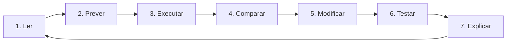

<div align="center">


**Uma trilha visual para aprender, prever, executar, testar e explicar.**

[Começar pelos fundamentos](Introducao-a-Logica-de-Programacao-com-Python) · [Abrir o repositório](https://github.com/matheusflorindo32/dio-estudos-logica-python) · [Ver qualidade](https://github.com/matheusflorindo32/dio-estudos-logica-python/actions)

</div>

---

## Seu mapa de aprendizagem

| Etapa | Pergunta central | Página | Sinal visual |
|---:|---|---|---|
| **01** | Como transformar um problema em passos executáveis? | [Lógica de Programação](Introducao-a-Logica-de-Programacao-com-Python) | 🔵 Fundamentos |
| **02** | Como o programa escolhe um caminho? | [Estruturas Condicionais](Estruturas-Condicionais) | 🔴 Decisão |
| **03** | Como repetir sem duplicar código? | [Estruturas de Repetição](Estruturas-de-Repeticao) | 🟡 Iteração |
| **04** | Como organizar e reutilizar uma regra? | [Funções em Python](Funcoes-em-Python) | 🟢 Abstração |

> [!TIP]
> **Siga a ordem das cores.** Cada página reutiliza a mesma linguagem visual para reduzir a desorientação e destacar o tipo de raciocínio exigido.

## O ciclo de estudo



<table>
<tr>
<td width="33%" valign="top">

### 👁️ Antes de executar
- identifique entradas;
- marque a regra principal;
- preveja a saída;
- localize possíveis erros.

</td>
<td width="33%" valign="top">

### ▶️ Durante a execução
- altere uma variável por vez;
- observe mensagens e traceback;
- acompanhe o estado;
- compare previsto × observado.

</td>
<td width="33%" valign="top">

### ✅ Depois de executar
- explique o resultado;
- teste limites;
- provoque um erro válido;
- registre o que mudou.

</td>
</tr>
</table>

## Objetivos da Wiki

Ao concluir a trilha, você deverá ser capaz de:

- decompor problemas em **entrada, processamento, validação e saída**;
- reconhecer quando usar condições, repetições e funções;
- prever o fluxo de pequenos algoritmos;
- separar regras de negócio da interface de terminal;
- testar casos normais, valores de fronteira e entradas inválidas;
- explicar o comportamento do código com suas próprias palavras.

> [!NOTE]
> A Wiki é orientada por literatura publicada em educação em computação, mas não afirma eficácia experimental própria. O que o projeto verifica diretamente é o comportamento do software por meio de testes, cobertura, lint, tipagem e CI.

## Diagnóstico rápido

Marque mentalmente o que você já consegue fazer:

- [ ] explicar a diferença entre valor, variável e tipo;
- [ ] prever qual bloco de um `if` será executado;
- [ ] rastrear o valor de uma variável dentro de um laço;
- [ ] distinguir `return` de `print`;
- [ ] criar um teste para um valor de fronteira;
- [ ] interpretar uma mensagem de erro simples.

Se marcou menos de três itens, comece em [Lógica de Programação](Introducao-a-Logica-de-Programacao-com-Python).

## Primeiro experimento

```python
nome = "Ana"

if nome:
    print(f"Olá, {nome}!")
```

| Elemento | O que observar |
|---|---|
| `nome = "Ana"` | uma variável recebe um texto |
| `if nome` | uma string não vazia é avaliada como verdadeira |
| `f"Olá, {nome}!"` | o valor é inserido na mensagem |
| `print(...)` | a saída torna o comportamento observável |

> [!IMPORTANT]
> Antes de executar, escreva a saída esperada. Depois altere `nome` para uma string vazia e explique por que nada é impresso.

## Prática conectada ao repositório

1. clone o [repositório principal](https://github.com/matheusflorindo32/dio-estudos-logica-python);
2. abra a página correspondente ao desafio;
3. execute o arquivo em `desafios/`;
4. localize os testes relacionados em `tests/`;
5. modifique uma regra e observe quais testes falham;
6. restaure o comportamento e confirme o CI local.

## Erros de estudo que reduzem a aprendizagem

> [!WARNING]
> - copiar código sem prever o resultado;
> - alterar muitas linhas ao mesmo tempo;
> - ignorar mensagens de erro;
> - testar apenas o caso de sucesso;
> - decorar sintaxe sem acompanhar o estado das variáveis.

## Desafio de abertura

Escolha um problema cotidiano simples — desconto, média, classificação ou contagem — e registre:

| Campo | Sua resposta |
|---|---|
| Entrada | quais dados entram? |
| Processamento | qual cálculo ou regra ocorre? |
| Validação | o que deve ser rejeitado? |
| Saída | qual resultado será devolvido? |
| Estrutura | condição, repetição ou função? |
| Teste de fronteira | qual valor fica exatamente no limite? |

## Referência central

ROBINS, Anthony; ROUNTREE, Janet; ROUNTREE, Nathan. Learning and teaching programming: a review and discussion. *Computer Science Education*, v. 13, n. 2, p. 137-172, 2003. DOI: <https://doi.org/10.1076/csed.13.2.137.14200>.

---

<div align="center">

**Próxima etapa:** [Introdução à Lógica de Programação com Python →](Introducao-a-Logica-de-Programacao-com-Python)

</div>
