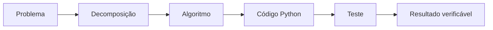

<div align="center">


[← Home](Home) · [Condicionais →](Estruturas-Condicionais)

</div>

---

## O que você vai aprender

| Competência | Evidência de aprendizagem |
|---|---|
| Decompor problemas | identifica entrada, processamento, validação e saída |
| Representar dados | escolhe variáveis e tipos coerentes |
| Construir expressões | combina operadores com intenção clara |
| Ler fluxo | prevê o resultado antes de executar |
| Verificar comportamento | testa casos normais, limites e erros |

> [!TIP]
> **Não tente memorizar tudo.** Concentre-se em explicar o que muda em cada linha e por que o resultado aparece.

## 1. Da situação ao algoritmo

Um **algoritmo** é uma sequência finita e não ambígua de passos. Um **programa** é a implementação desses passos em uma linguagem executável.



### Modelo mental essencial

<table>
<tr>
<td width="25%" valign="top">

### 1. Entrada
Dados recebidos pelo programa.

</td>
<td width="25%" valign="top">

### 2. Processamento
Cálculo ou transformação.

</td>
<td width="25%" valign="top">

### 3. Validação
Regras que rejeitam dados inválidos.

</td>
<td width="25%" valign="top">

### 4. Saída
Resultado devolvido ou exibido.

</td>
</tr>
</table>

### Exemplo: média de duas notas

```text
Entrada: nota_1 e nota_2
Processamento: (nota_1 + nota_2) / 2
Validação: aceitar somente valores entre 0 e 10
Saída: média calculada
```

> [!IMPORTANT]
> A validação não é detalhe. Sem ela, o programa pode produzir uma resposta tecnicamente executável, mas semanticamente incorreta.

## 2. Variáveis e tipos

```python
nome = "Ana"          # str
idade = 20            # int
altura = 1.68         # float
estudante = True      # bool
```

| Tipo | Representa | Exemplo |
|---|---|---|
| `str` | texto | `"Python"` |
| `int` | número inteiro | `20` |
| `float` | número decimal | `1.68` |
| `bool` | verdadeiro ou falso | `True` |

> [!NOTE]
> Em Python, o tipo é associado ao valor. Nomes claros como `media_final` comunicam melhor a intenção do que nomes vagos como `m`.

### Microatividade

```python
nome = "Carlos"
idade = 19
maior_de_idade = idade >= 18
```

Antes de executar, responda:

1. qual é o tipo de `nome`?
2. qual é o tipo de `idade`?
3. qual expressão produz o valor de `maior_de_idade`?
4. o resultado será `True` ou `False`?

## 3. Operadores e expressões

| Grupo | Operadores | Pergunta que respondem |
|---|---|---|
| Aritméticos | `+ - * / // % **` | qual cálculo será feito? |
| Comparação | `== != < <= > >=` | a relação é verdadeira? |
| Lógicos | `and or not` | como combinar condições? |

```python
media = (8.0 + 7.0) / 2
aprovado = media >= 7
```

### Rastreamento visual

```text
8.0 + 7.0 = 15.0
15.0 / 2 = 7.5
7.5 >= 7 = True
```

## 4. As três estruturas que organizam o fluxo

| Estrutura | Função cognitiva | Exemplo |
|---|---|---|
| Condição | escolher | `if media >= 7:` |
| Repetição | percorrer ou repetir | `for nota in notas:` |
| Função | agrupar e reutilizar | `def calcular_media(...):` |

- [Aprofundar condicionais](Estruturas-Condicionais)
- [Aprofundar repetições](Estruturas-de-Repeticao)
- [Aprofundar funções](Funcoes-em-Python)

## 5. Primeiro programa completo

```python
def calcular_media(nota_1: float, nota_2: float) -> float:
    """Calcula a média de duas notas válidas."""
    if not 0 <= nota_1 <= 10 or not 0 <= nota_2 <= 10:
        raise ValueError("As notas devem estar entre 0 e 10.")
    return (nota_1 + nota_2) / 2


media = calcular_media(8.0, 7.0)
print(f"Média: {media:.1f}")
```

### Leitura em camadas

| Camada | O que acontece |
|---|---|
| Assinatura | recebe duas notas e promete devolver `float` |
| Docstring | registra o propósito |
| Validação | rejeita valores fora de `0..10` |
| Processamento | calcula a média |
| Retorno | entrega o resultado |
| Interface | apresenta a saída formatada |

> [!TIP]
> Cubra o código e tente reconstruir cada camada com suas próprias palavras.

## 6. Estratégia 3×3 de estudo

### Antes
1. identifique os dados;
2. preveja a saída;
3. marque o possível erro.

### Durante
1. execute o exemplo original;
2. altere um valor;
3. compare o comportamento.

### Depois
1. explique a mudança;
2. teste um limite;
3. escreva um teste automatizado.

## 7. Erros comuns

> [!WARNING]
> - começar a programar sem definir entrada e saída;
> - confundir texto numérico com `int` ou `float`;
> - usar nomes que escondem o significado;
> - ignorar precedência de operadores;
> - testar somente um valor conveniente.

## 8. Exercício guiado

Crie um programa que:

- receba o nome de um estudante;
- receba duas notas;
- rejeite valores fora de `0..10`;
- calcule a média;
- informe o resultado.

### Casos mínimos de teste

| Entrada | Resultado esperado |
|---|---|
| `7` e `8` | média `7.5` |
| `0` e `10` | média `5.0` |
| `-1` e `5` | erro |
| `7` e `11` | erro |

## 9. Desafio independente

Modele um conversor que receba minutos e devolva horas e minutos restantes.

Teste: `0`, `59`, `60` e `125`.

## 10. Prática no projeto

```bash
python desafios/01_variaveis.py
```

Depois localize os testes correspondentes e responda:

- quais entradas são aceitas?
- quais valores de fronteira são testados?
- qual comportamento falharia se a validação fosse removida?

## Referências

LYE, Sze Yee; KOH, Joyce Hwee Ling. Review on teaching and learning of computational thinking through programming: what is next for K-12? *Computers in Human Behavior*, v. 41, p. 51-61, 2014. DOI: <https://doi.org/10.1016/j.chb.2014.09.012>.

ROBINS, Anthony; ROUNTREE, Janet; ROUNTREE, Nathan. Learning and teaching programming: a review and discussion. *Computer Science Education*, v. 13, n. 2, p. 137-172, 2003. DOI: <https://doi.org/10.1076/csed.13.2.137.14200>.

SWELLER, John. Cognitive load during problem solving: effects on learning. *Cognitive Science*, v. 12, n. 2, p. 257-285, 1988. DOI: <https://doi.org/10.1207/s15516709cog1202_4>.

WING, Jeannette M. Computational thinking. *Communications of the ACM*, v. 49, n. 3, p. 33-35, 2006. DOI: <https://doi.org/10.1145/1118178.1118215>.

PYTHON SOFTWARE FOUNDATION. *Python 3.14 documentation*. Disponível em: <https://docs.python.org/3.14/>. Acesso em: 2 ago. 2026.

---

<div align="center">

[← Home](Home) · **Próxima etapa:** [Estruturas Condicionais →](Estruturas-Condicionais)

</div>
